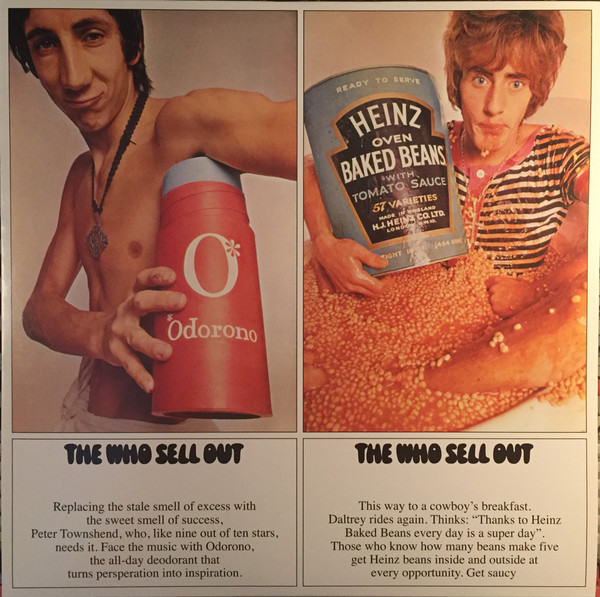

# The Who Sell Out

By The Who

## Album Data

[Discogs URL](https://www.discogs.com/release/6811330-The-Who-The-Who-Sell-Out)

- Catalog #: B0022559-01
- Label: Geffen Records, Track Record
- Formats: Vinyl, 180 gram
- Format: LP, Album, RE, 180, Reissue, Stereo
- Rating: 
- Released: 2015
- Year: 1967
- Release ID: 6811330
- Media condition: Mint (M)
- Sleeve condition: Mint (M)
- Speed: 33 rpm
- Weight: 180 gram

## Album Tracks

| **Position** | **Title** | **Duration** |
|--------------|-----------|--------------|
| A1 | **Armenia City In The Skies** |  |
| A2 | **Heinz Baked Beans** |  |
| A3 | **Mary Anne With The Shaky Hands** |  |
| A4 | **Odorono** |  |
| A5 | **Tattoo** |  |
| A6 | **Our Love Was** |  |
| A7 | **I Can See For Miles** |  |
| B1 | **Can't Reach You** |  |
| B2 | **Medac** |  |
| B3 | **Relax** |  |
| B4 | **Silas Stingy** |  |
| B5 | **Sunrise** |  |
| B6 | **Rael (1 And 2)** |  |

## Artist Roles

| **Name** | **Role** |
|----------|----------|
| **Adrian George** | Artwork [Poster] |
| **David King (7)** | Design [Cover] |
| **Roger Law** | Design [Cover] |
| **Chris Stamp** | Executive-Producer |
| **Miles Showell** | Lacquer Cut By |
| **David Montgomery (4)** | Photography By |
| **Kit Lambert** | Producer |

## See also

- [A Quick One](A_Quick_One.md)
- [My Generation](My_Generation.md)
- [Squeeze Box](Squeeze_Box.md)
- [Tommy](Tommy.md)
- [Who Are You](Who_Are_You.md)
- [Who's Missing](Whos_Missing.md)
- [Who's Next](Whos_Next.md)
- [Beets: A Quick One](../../Beets/The_Who/A_Quick_One.md)
- [Beets: Face Dances](../../Beets/The_Who/Face_Dances.md)
- [Beets: Live at Leeds](../../Beets/The_Who/Live_at_Leeds.md)
- [Beets: My Generation](../../Beets/The_Who/My_Generation.md)
- [Beets: Odds & Sods](../../Beets/The_Who/Odds_and_Sods.md)
- [Beets: The Who Sell Out](../../Beets/The_Who/The_Who_Sell_Out.md)
- [Beets: Tommy](../../Beets/The_Who/Tommy.md)
- [Beets: Who’s Next](../../Beets/The_Who/Who’s_Next.md)
- [Beets: Who's Next](../../Beets/The_Who/Whos_Next.md)
- [CD: ](../../CD/The_Who/The_Who.md)
- [CD: Tommy](../../CD/The_Who/Tommy.md)
- [Roon: A Quick One (Stereo Version)](../../Roon/The_Who/A_Quick_One_Stereo_Version.md)
- [Roon: Face Dances](../../Roon/The_Who/Face_Dances.md)
- [Roon: Live At Leeds (Live At Leeds/1970)](../../Roon/The_Who/Live_At_Leeds_Live_At_Leeds-1970.md)
- [Roon: My Generation (Stereo Version)](../../Roon/The_Who/My_Generation_Stereo_Version.md)
- [Roon: Quadrophenia (Super Deluxe)](../../Roon/The_Who/Quadrophenia_Super_Deluxe.md)
- [Roon: The Who Sell Out (Super Deluxe)](../../Roon/The_Who/The_Who_Sell_Out_Super_Deluxe.md)
- [Roon: Tommy (Super Deluxe)](../../Roon/The_Who/Tommy_Super_Deluxe.md)
- [Roon: Who's Next (Deluxe Edition)](../../Roon/The_Who/Whos_Next_Deluxe_Edition.md)
