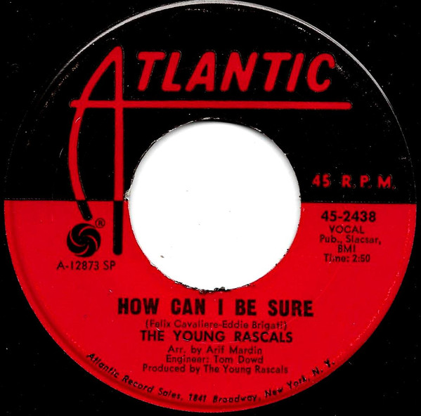

# How Can I Be Sure

By The Young Rascals

## Album Data

[Discogs URL](https://www.discogs.com/release/1332403-The-Young-Rascals-How-Can-I-Be-Sure)

- Catalog #: 45-2438
- Label: Atlantic
- Format: 7", Single, SP 
- Rating: 
- Released: 1967
- Release ID: 1332403
- Media condition: Very Good Plus (VG+)
- Sleeve condition: 
- Speed: 45 rpm
- Weight: 

## See also

- [A Girl Like You / It's Love](A_Girl_Like_You_-_Its_Love.md)
