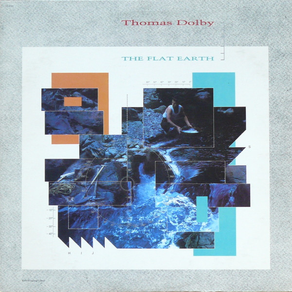

# The Flat Earth

By Thomas Dolby

## Album Data

[Discogs URL](https://www.discogs.com/release/426362-Thomas-Dolby-The-Flat-Earth)

- Catalog #: ST-12309
- Label: Capitol Records
- Format: LP, Album, Jac
- Rating: 
- Released: 1984
- Release ID: 426362
- Media condition: Very Good Plus (VG+)
- Sleeve condition: Very Good Plus (VG+)
- Speed: 33 rpm
- Weight: 

## See also

- [Blinded By Science](Blinded_By_Science.md)
- [The Golden Age Of Wireless](The_Golden_Age_Of_Wireless.md)
