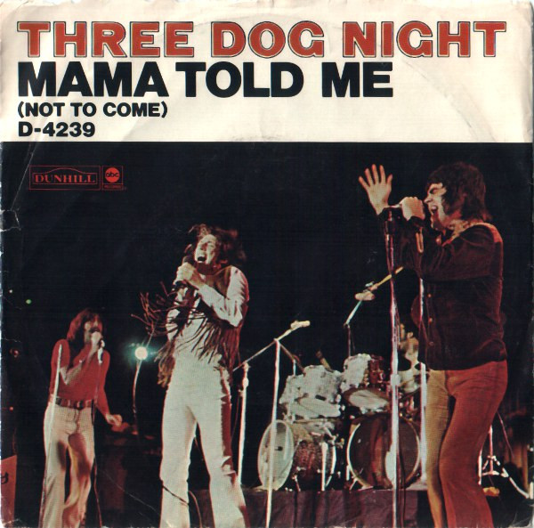

# Mama Told Me (Not To Come)

By Three Dog Night

## Album Data

[Discogs URL](https://www.discogs.com/release/2424477-Three-Dog-Night-Mama-Told-Me-(Not-To-Come))

- Catalog #: D-4239
- Label: ABC/Dunhill Records
- Format: 7", Single, Styrene, Mon
- Rating: 
- Released: 1970
- Release ID: 2424477
- Media condition: Very Good Plus (VG+)
- Sleeve condition: 
- Speed: 45 rpm
- Weight: 

## Album Tracks

| **Position** | **Title** | **Duration** |
|--------------|-----------|--------------|
| A | **Mama Told Me (Not To Come)** | 2:58 |
| B | **Rock & Roll Widow** | 2:56 |

## Artist Roles

| **Name** | **Role** |
|----------|----------|
| **Richard Podolor** | Producer |

## See also

- 
- [Beets: The Best of Three Dog Night](../../Beets/Three_Dog_Night/The_Best_of_Three_Dog_Night.md)
- [Roon: It Ain't Easy](../../Roon/Three_Dog_Night/It_Aint_Easy.md)
- [Roon: Naturally](../../Roon/Three_Dog_Night/Naturally.md)
- [Roon: Suitable For Framing](../../Roon/Three_Dog_Night/Suitable_For_Framing.md)
- [Roon: The Best Of 3 Dog Night](../../Roon/Three_Dog_Night/The_Best_Of_3_Dog_Night.md)
- [Roon: Three Dog Night](../../Roon/Three_Dog_Night/Three_Dog_Night.md)
