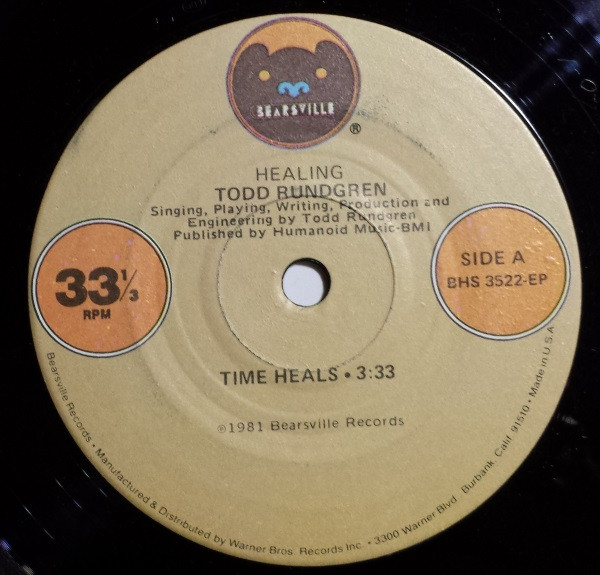

# Time Heals

By Todd Rundgren

## Album Data

[Discogs URL](https://www.discogs.com/release/5065869-Todd-Rundgren-Time-Heals)

- Catalog #: BHS 3522-ep
- Label: Bearsville
- Formats: Vinyl
- Format: 7", 33 ⅓ RPM
- Rating: 
- Released: 1981
- Year: 1981
- Release ID: 5065869
- Media condition: Very Good (VG)
- Sleeve condition: 
- Speed: 45 rpm
- Weight: 

## Album Tracks

| **Position** | **Title** | **Duration** |
|--------------|-----------|--------------|
| A | **Time Heals** | 3:33 |
| B | **Tiny Demons** | 3:08 |

## Artist Roles

| **Name** | **Role** |
|----------|----------|
| **Todd Rundgren** | Vocals, Instruments, Written-By, Producer, Engineer |

## See also

- ["A Wizard, A True Star"](A_Wizard__A_True_Star.md)
- [Todd](Todd.md)
- [Beets: 2nd Wind](../../Beets/Todd_Rundgren/2nd_Wind.md)
- [Beets: Almost Famous](../../Beets/Todd_Rundgren/Almost_Famous.md)
- [Beets: Arena](../../Beets/Todd_Rundgren/Arena.md)
- [Beets: At the BBC 1972-1982](../../Beets/Todd_Rundgren/At_the_BBC_1972-1982.md)
- [Beets: A Wizard, a True Star](../../Beets/Todd_Rundgren/A_Wizard__a_True_Star.md)
- [Beets: A Wizard/A True Star](../../Beets/Todd_Rundgren/A_Wizard-A_True_Star.md)
- [Beets: Box O' Todd](../../Beets/Todd_Rundgren/Box_O_Todd.md)
- [Beets: Faithful](../../Beets/Todd_Rundgren/Faithful.md)
- [Beets: Grok This](../../Beets/Todd_Rundgren/Grok_This.md)
- [Beets: Initiation](../../Beets/Todd_Rundgren/Initiation.md)
- [Beets: No World Order](../../Beets/Todd_Rundgren/No_World_Order.md)
- [Beets: [Re]Production](../../Beets/Todd_Rundgren/[Re]Production.md)
- [Beets: State [Disc 2]](../../Beets/Todd_Rundgren/State_[Disc_2].md)
- [Beets: State](../../Beets/Todd_Rundgren/State.md)
- [Beets: The Ever Popular Tortured Artist Effect](../../Beets/Todd_Rundgren/The_Ever_Popular_Tortured_Artist_Effect.md)
- [Beets: Todd](../../Beets/Todd_Rundgren/Todd.md)
- [Beets: Todd Rundgren](../../Beets/Todd_Rundgren/Todd_Rundgren.md)
- [Beets: Todd Rundgren's Johnson](../../Beets/Todd_Rundgren/Todd_Rundgrens_Johnson.md)
- [Beets: Todd Rundgren vs. Utopia](../../Beets/Todd_Rundgren/Todd_Rundgren_vs_Utopia.md)
- [Beets: White Knight](../../Beets/Todd_Rundgren/White_Knight.md)
- [Beets: With a Twist...](../../Beets/Todd_Rundgren/With_a_Twist.md)
- [CD: Todd](../../CD/Todd_Rundgren/Todd.md)
- [CD: ](../../CD/Todd_Rundgren/Todd_Rundgren.md)
- [Roon: A Cappella](../../Roon/Todd_Rundgren/A_Cappella.md)
- [Roon: An Elpee's Worth of Productions](../../Roon/Todd_Rundgren/An_Elpees_Worth_of_Productions.md)
- [Roon: Arena](../../Roon/Todd_Rundgren/Arena.md)
- [Roon: A Wizard / A True Star](../../Roon/Todd_Rundgren/A_Wizard_-_A_True_Star.md)
- [Roon: Deface The Music](../../Roon/Todd_Rundgren/Deface_The_Music.md)
- [Roon: Faithful](../../Roon/Todd_Rundgren/Faithful.md)
- [Roon: Initiation](../../Roon/Todd_Rundgren/Initiation.md)
- [Roon: RA](../../Roon/Todd_Rundgren/RA.md)
- [Roon: Second Wind (Live at the Palace of Fine Arts Theatre, San Francisco, CA, July 1990)](../../Roon/Todd_Rundgren/Second_Wind_Live_at_the_Palace_of_Fine_Arts_Theatre__San_Francisco__CA__July_1990.md)
- [Roon: Something / Anything?](../../Roon/Todd_Rundgren/Something_-_Anything.md)
- [Roon: State Theater New Jersey 2005 (Live)](../../Roon/Todd_Rundgren/State_Theater_New_Jersey_2005_Live.md)
- [Roon: Swing To The Right](../../Roon/Todd_Rundgren/Swing_To_The_Right.md)
- [Roon: The 70's Collection](../../Roon/Todd_Rundgren/The_70s_Collection.md)
- [Roon: Todd](../../Roon/Todd_Rundgren/Todd.md)
- [Roon: Todd Rundgren at the BBC](../../Roon/Todd_Rundgren/Todd_Rundgren_at_the_BBC-_1972-1982.md)
- [Roon: Todd Rundgren's Utopia](../../Roon/Todd_Rundgren/Todd_Rundgrens_Utopia.md)
- [Roon: White Knight](../../Roon/Todd_Rundgren/White_Knight.md)
