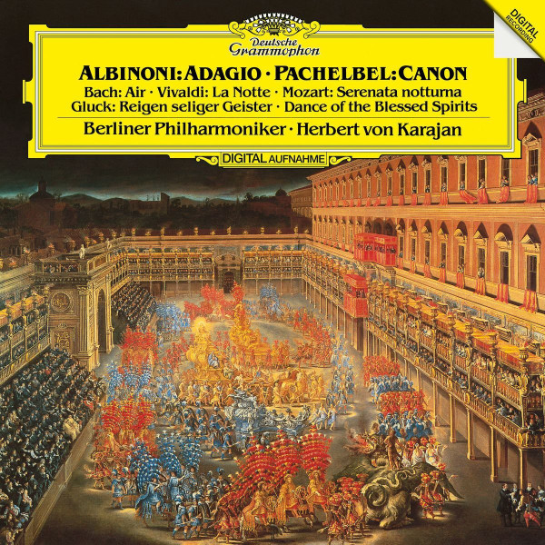

# "Albinoni: Adagio, Pachelbel: Canon"

By "Tomaso Albinoni, Johann Pachelbel, Berliner Philharmoniker, Herbert von Karajan"

## Album Data

[Discogs URL](https://www.discogs.com/release/9366153-"Tomaso-Albinoni,-Johann-Pachelbel,-Berliner-Philharmoniker,-Herbert-von-Karajan"-"Albinoni:-Adagio,-Pachelbel:-Canon")

- Catalog #: 479 6336
- Label: Deutsche Grammophon
- Format: LP, Album, RE
- Rating: 
- Released: 2016
- Release ID: 9366153
- Media condition: Mint (M)
- Sleeve condition: Mint (M)
- Speed: 33 rpm
- Weight: 180 gram

## Album Tracks

| **Position** | **Title** | **Duration** |
|--------------|-----------|--------------|
| A1 | **Adagio In G Minor For Strings And Organ** | 11:44 |
| A2 | **Concerto For Flutre, Strings, And Harpsichord In G Minor, Op. 10 No. 2 (RV 439)** | 9:17 |
| A3 | **Air, From Ouverture Nr. 3 D-dur BWV 1068** | 5:59 |
| B1 | **Canon And Gigue In D Major For 3 Violins And Basso Continuo** | 7:02 |
| B2 | **Dance Of The Blessed Spirits, From The Opera "Orpheus And Eurydice"** | 6:43 |
| B3 | **Serenata Notturna In D Major, K. 239** | 13:15 |

## See also

- 
