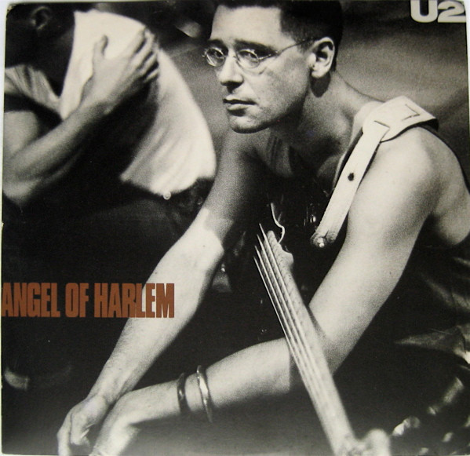

# Angel Of Harlem

By U2

## Album Data

[Discogs URL](https://www.discogs.com/release/750203-U2-Angel-Of-Harlem)

- Catalog #: 7-99254
- Label: Island Records
- Format: 7", Single, All
- Rating: 
- Released: 1988
- Release ID: 750203
- Media condition: Near Mint (NM or M-)
- Sleeve condition: Near Mint (NM or M-)
- Speed: 45 rpm
- Weight: 

## Album Tracks

| **Position** | **Title** | **Duration** |
|--------------|-----------|--------------|
| A | **Angel Of Harlem** | 3:42 |
| B | **A Room At The Heartbreak Hotel** | 5:29 |

## Artist Roles

| **Name** | **Role** |
|----------|----------|
| **DZN, The Design Group** | Design |
| **Arnie Acosta** | Lacquer Cut By |
| **U2** | Music By |
| **Colm Henry** | Photography By [Front Cover] |
| **Bono** | Words By |

## See also

- [Desire](Desire.md)
- [Beets: Invisible (RED) Edit Version](../../Beets/U2/Invisible_RED_Edit_Version.md)
- [Beets: Songs of Innocence](../../Beets/U2/Songs_of_Innocence.md)
