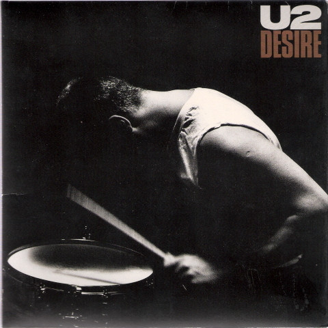

# Desire

By U2

## Album Data

[Discogs URL](https://www.discogs.com/release/750205-U2-Desire)

- Catalog #: 7-99250
- Label: Island Records
- Formats: Vinyl, Gatefold
- Format: 7", Single, Gat, 45 RPM
- Rating: 
- Released: 1988
- Year: 1988
- Release ID: 750205
- Media condition: Near Mint (NM or M-)
- Sleeve condition: Near Mint (NM or M-)
- Speed: 45 rpm
- Weight: 

## Album Tracks

| **Position** | **Title** | **Duration** |
|--------------|-----------|--------------|
| A | **Desire** | 2:59 |
| B | **Hallelujah Here She Comes** | 4:12 |

## Artist Roles

| **Name** | **Role** |
|----------|----------|
| **DZN, The Design Group** | Design |
| **Steve Averill** | Design [Based On An Idea By] |
| **Works Associates** | Design [Based On An Idea By] |
| **U2** | Music By |
| **Anton Corbijn** | Photography By |
| **Bill Rubenstein (2)** | Photography By [Back Cover] |
| **Jimmy Iovine** | Producer |
| **Bono** | Words By |

## See also

- [Angel Of Harlem](Angel_Of_Harlem.md)
- [Beets: Invisible (RED) Edit Version](../../Beets/U2/Invisible_RED_Edit_Version.md)
- [Beets: Songs of Innocence](../../Beets/U2/Songs_of_Innocence.md)
