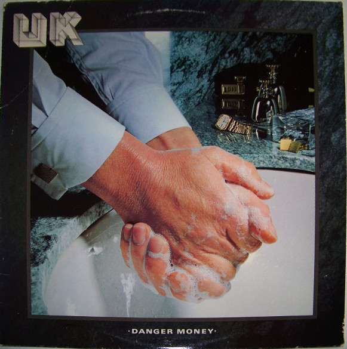

# Danger Money

By UK

## Album Data

[Discogs URL](https://www.discogs.com/release/972761-UK-(3)-Danger-Money)

- Catalog #: PD-1-6194
- Label: Polydor
- Formats: Vinyl, Keel Mfg. Pressing
- Format: LP, Album, Kee
- Rating: 
- Released: 1979
- Year: 1979
- Release ID: 972761
- Media condition: Very Good Plus (VG+)
- Sleeve condition: Very Good Plus (VG+)
- Speed: 33 rpm
- Weight: 

## Album Tracks

| **Position** | **Title** | **Duration** |
|--------------|-----------|--------------|
| A1 | **Danger Money** | 8:15 |
| A2 | **Rendezvous 6.02** | 5:00 |
| A3 | **The Only Thing She Needs** | 7:57 |
| B1 | **Caesar's Palace Blues** | 4:45 |
| B2 | **Nothing To Lose** | 3:58 |
| B3 | **Carrying No Cross** | 12:22 |

## Artist Roles

| **Name** | **Role** |
|----------|----------|
| **Dave Fidler (2)** | Crew |
| **Graham Davies (2)** | Crew |
| **Hipgnosis (2)** | Design [Cover Design], Photography By |
| **Terry Bozzio** | Drums, Percussion |
| **John Punter** | Engineer |
| **Nigel Walker** | Engineer [Assistant] |
| **George Marino** | Mastered By |
| **Eddie Jobson** | Producer, Arranged By, Keyboards, Electric Violin, Written-By |
| **John Wetton** | Producer, Arranged By, Voice [Lead], Bass, Written-By |
| **Geoff Emerick** | Recorded By [Backing Tracks] |

## See also

- 
