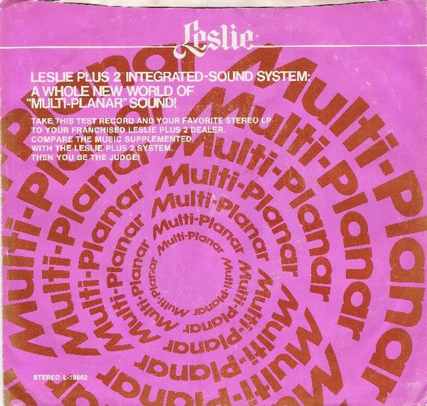

# "Leslie Plus 2 Integrated Sound System: A Whole New World Of ""Multi-Planar"" Sound!"

By Unknown Artist

## Album Data

[Discogs URL](https://www.discogs.com/release/5455966-Unknown-Artist-"Leslie-Plus-2-Integrated-Sound-System:-A-Whole-New-World-Of-""Multi-Planar""-Sound!")

- Catalog #: L-10002, L-1002
- Label: Leslie, Leslie
- Formats: Vinyl
- Format: 7", 33 ⅓ RPM
- Rating: 
- Released: 0
- Year: null
- Release ID: 5455966
- Media condition: Near Mint (NM or M-)
- Sleeve condition: Near Mint (NM or M-)
- Speed: 45 rpm
- Weight: 

## Album Tracks

| **Position** | **Title** | **Duration** |
|--------------|-----------|--------------|
| A | **Narration And Standing Wave Test** |  |
| B | **Test Music** |  |

## Artist Roles

| **Name** | **Role** |
|----------|----------|
| **Ralph Eck** | Lacquer Cut By |

## See also

- 
