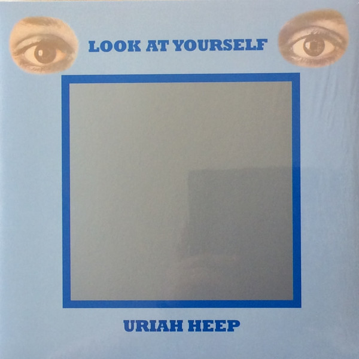

# Look At Yourself

By Uriah Heep

## Album Data

[Discogs URL](https://www.discogs.com/release/7564790-Uriah-Heep-Look-At-Yourself)

- Catalog #: BMGRM086LP
- Label: Sanctuary Records, BMG, Bronze
- Formats: Vinyl, 180 gram
- Format: LP, Album, RE, 180, Reissue, Stereo
- Rating: 
- Released: 2015
- Year: 1971
- Release ID: 7564790
- Media condition: Mint (M)
- Sleeve condition: Mint (M)
- Speed: 33 rpm
- Weight: 180 gram

## Album Tracks

| **Position** | **Title** | **Duration** |
|--------------|-----------|--------------|
| A1 | **Look At Yourself** | 5:07 |
| A2 | **I Wanna Be Free** | 3:59 |
| A3 | **July Morning** | 10:36 |
| B1 | **Tears In My Eyes** | 5:02 |
| B2 | **Shadows Of Grief** | 8:40 |
| B3 | **What Should Be Done** | 4:13 |
| B4 | **Love Machine** | 3:37 |

## Artist Roles

| **Name** | **Role** |
|----------|----------|
| **Uriah Heep** | Arranged By |
| **Paul Newton (2)** | Bass Guitar |
| **Douglas Maxwell Ltd.** | Design |
| **Mick Box** | Lead Guitar, Acoustic Guitar |
| **David Byron** | Lead Vocals |
| **Ken Hensley** | Liner Notes |
| **KR (3)** | Mastered By |
| **Ken Hensley** | Organ, Piano, Guitar, Acoustic Guitar, Vocals |
| **Tony Evans (8)** | Photography By |
| **Gerry Bron** | Producer |

## See also

- [Demons And Wizards](Demons_And_Wizards.md)
- [The Magician's Birthday](The_Magicians_Birthday.md)
- [Beets: 20th Century Masters](../../Beets/Uriah_Heep/20th_Century_Masters.md)
- [Beets: Demons and Wizards](../../Beets/Uriah_Heep/Demons_and_Wizards.md)
- [Beets: Look at Yourself](../../Beets/Uriah_Heep/Look_at_Yourself.md)
- [Beets: The Magician’s Birthday](../../Beets/Uriah_Heep/The_Magician’s_Birthday.md)
- [Roon: Demons and Wizards (Expanded Version)](../../Roon/Uriah_Heep/Demons_and_Wizards_Expanded_Version.md)
- [Roon: Look At Yourself (Expanded Version)](../../Roon/Uriah_Heep/Look_At_Yourself_Expanded_Version.md)
- [Roon: The Magician's Birthday](../../Roon/Uriah_Heep/The_Magicians_Birthday.md)
- [Roon: Travellers In Time](../../Roon/Uriah_Heep/Travellers_In_Time-_Anthology__Vol_1.md)
- [Roon: Very 'Eavy, Very 'Umble (Expanded Version)](../../Roon/Uriah_Heep/Very_Eavy__Very_Umble_Expanded_Version.md)
