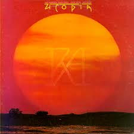

# Ra

By Utopia

## Album Data

[Discogs URL](https://www.discogs.com/release/4821992-Utopia-(5)-Ra)

- Catalog #: RNLP 70869
- Label: Bearsville, Rhino Records
- Format: LP, Album, RE, RM, DMM
- Rating: 
- Released: 1987
- Release ID: 4821992
- Media condition: Mint (M)
- Sleeve condition: Mint (M)
- Speed: 33 rpm
- Weight: 

## See also

- [Swing To The Right](Swing_To_The_Right.md)
- [Beets: Disco Jets](../../Beets/Utopia/Disco_Jets.md)
- [Beets: RA](../../Beets/Utopia/RA.md)
- [Beets: Swing to the Right](../../Beets/Utopia/Swing_to_the_Right.md)
- [Beets: Todd Rundgren's Utopia](../../Beets/Utopia/Todd_Rundgrens_Utopia.md)
- [Roon: Deface The Music](../../Roon/Utopia/Deface_The_Music.md)
- [Roon: Disco Jets](../../Roon/Utopia/Disco_Jets.md)
- [Roon: RA](../../Roon/Utopia/RA.md)
- [Roon: Swing To The Right](../../Roon/Utopia/Swing_To_The_Right.md)
- [Roon: Todd Rundgren's Utopia](../../Roon/Utopia/Todd_Rundgrens_Utopia.md)
