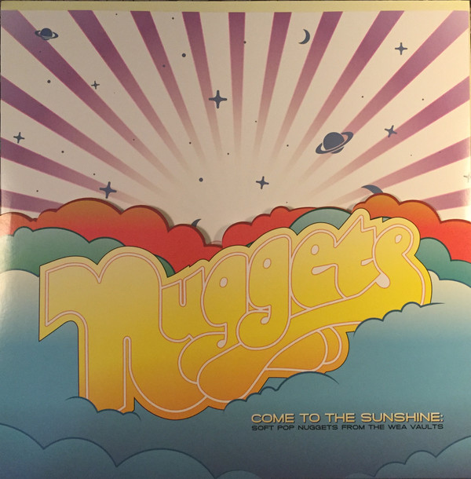

# Come To The Sunshine: Soft Pop Nuggets From The WEA Vaults

By Various

## Album Data

[Discogs URL](https://www.discogs.com/release/10134041-Various-Come-To-The-Sunshine:-Soft-Pop-Nuggets-From-The-WEA-Vaults)

- Catalog #: 081227941055, R1 7818
- Label: Rhino Records (2), Rhino Records (2), Rhino Handmade, Rhino Handmade
- Format: 2xLP, Comp, Ltd, Ora
- Rating: 
- Released: 2017
- Release ID: 10134041
- Media condition: Mint (M)
- Sleeve condition: Mint (M)
- Speed: 33 rpm
- Weight: 

## See also

- [Easy Rider (Music From The Soundtrack)](Easy_Rider_Music_From_The_Soundtrack.md)
- [Girls In The Garage Volume 10 - Groovy Gallic Gals!](Girls_In_The_Garage_Volume_10_-_Groovy_Gallic_Gals!.md)
- [Girls In The Garage Volume 9 - Oriental Special](Girls_In_The_Garage_Volume_9_-_Oriental_Special.md)
- [Glasnost](Glasnost.md)
- [Party Party (Original Motion Picture Soundtrack)](Party_Party_Original_Motion_Picture_Soundtrack.md)
- [Performance](Performance-_Original_Motion_Picture_Sound_Track.md)
- [Popeye - Original Motion Picture Soundtrack Album](Popeye_-_Original_Motion_Picture_Soundtrack_Album.md)
- [Really Rock 'em Right - Sun Records Curated By Record Store Day Volume 4](Really_Rock_em_Right_-_Sun_Records_Curated_By_Record_Store_Day_Volume_4.md)
- [Resistance Radio](Resistance_Radio-_The_Man_In_The_High_Castle_Album.md)
