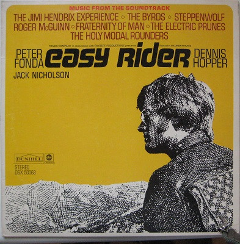

# Easy Rider (Music From The Soundtrack)

By Various

## Album Data

[Discogs URL](https://www.discogs.com/release/6169141-Various-Easy-Rider-(Music-From-The-Soundtrack))

- Catalog #: DSX 50063
- Label: ABC/Dunhill Records
- Formats: Vinyl, Santa Maria Pressing
- Format: LP, Comp, San, Compilation
- Rating: 
- Released: 1969
- Year: 1969
- Release ID: 6169141
- Media condition: Very Good Plus (VG+)
- Sleeve condition: Very Good Plus (VG+)
- Speed: 33 rpm
- Weight: 

## Album Tracks

| **Position** | **Title** | **Duration** |
|--------------|-----------|--------------|
| A1 | **The Pusher** | 5:48 |
| A2 | **Born To Be Wild** | 3:29 |
| A3 | **The Weight** | 4:29 |
| A4 | **Wasn't Born To Follow** | 2:03 |
| A5 | **If You Want To Be A Bird** | 2:35 |
| B1 | **Don't Bogart Me** | 3:02 |
| B2 | **If Six Was Nine** | 5:32 |
| B3 | **Kyrie Eleison** | 4:02 |
| B4 | **It's Alright Ma (I'm Only Bleeding)** | 3:03 |
| B5 | **Ballad Of Easy Rider** | 2:13 |

## See also

- [Come To The Sunshine](Come_To_The_Sunshine-_Soft_Pop_Nuggets_From_The_WEA_Vaults.md)
- [Girls In The Garage Volume 10 - Groovy Gallic Gals!](Girls_In_The_Garage_Volume_10_-_Groovy_Gallic_Gals!.md)
- [Girls In The Garage Volume 9 - Oriental Special](Girls_In_The_Garage_Volume_9_-_Oriental_Special.md)
- [Glasnost](Glasnost.md)
- [Party Party (Original Motion Picture Soundtrack)](Party_Party_Original_Motion_Picture_Soundtrack.md)
- [Performance](Performance-_Original_Motion_Picture_Sound_Track.md)
- [Popeye - Original Motion Picture Soundtrack Album](Popeye_-_Original_Motion_Picture_Soundtrack_Album.md)
- [Really Rock 'em Right - Sun Records Curated By Record Store Day Volume 4](Really_Rock_em_Right_-_Sun_Records_Curated_By_Record_Store_Day_Volume_4.md)
- [Resistance Radio](Resistance_Radio-_The_Man_In_The_High_Castle_Album.md)
- [Beets: Coming Up Roses](../../Beets/Various/Coming_Up_Roses.md)
