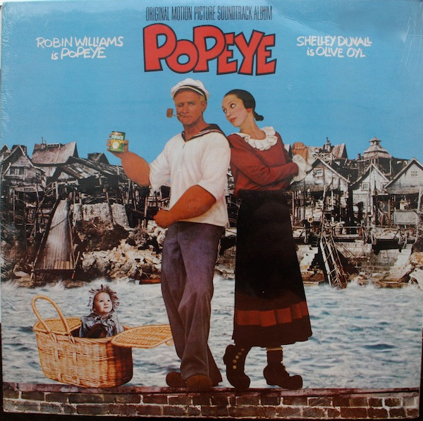

# Popeye - Original Motion Picture Soundtrack Album

By Various

## Album Data

[Discogs URL](https://www.discogs.com/release/2137850-Various-Popeye---Original-Motion-Picture-Soundtrack-Album)

- Catalog #: SW-36880, SW 36880
- Label: The Boardwalk Entertainment Co, The Boardwalk Entertainment Co
- Format: LP, Album, Pit
- Rating: 
- Released: 1980
- Release ID: 2137850
- Media condition: Good Plus (G+)
- Sleeve condition: Good Plus (G+)
- Speed: 33 rpm
- Weight: 

## See also

- [Come To The Sunshine](Come_To_The_Sunshine-_Soft_Pop_Nuggets_From_The_WEA_Vaults.md)
- [Easy Rider (Music From The Soundtrack)](Easy_Rider_Music_From_The_Soundtrack.md)
- [Girls In The Garage Volume 10 - Groovy Gallic Gals!](Girls_In_The_Garage_Volume_10_-_Groovy_Gallic_Gals!.md)
- [Girls In The Garage Volume 9 - Oriental Special](Girls_In_The_Garage_Volume_9_-_Oriental_Special.md)
- [Glasnost](Glasnost.md)
- [Party Party (Original Motion Picture Soundtrack)](Party_Party_Original_Motion_Picture_Soundtrack.md)
- [Performance](Performance-_Original_Motion_Picture_Sound_Track.md)
- [Really Rock 'em Right - Sun Records Curated By Record Store Day Volume 4](Really_Rock_em_Right_-_Sun_Records_Curated_By_Record_Store_Day_Volume_4.md)
- [Resistance Radio](Resistance_Radio-_The_Man_In_The_High_Castle_Album.md)
