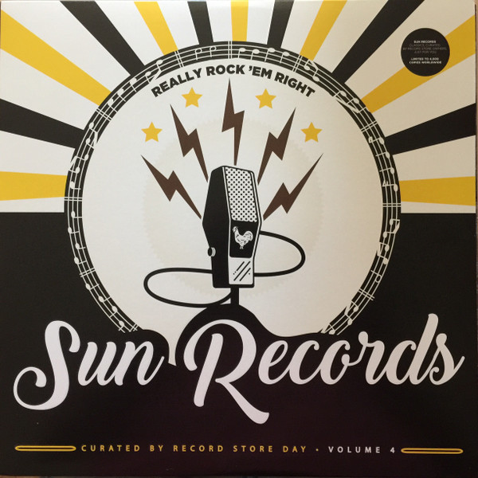

# Really Rock 'em Right - Sun Records Curated By Record Store Day Volume 4

By Various

## Album Data

[Discogs URL](https://www.discogs.com/release/10174655-Various-Really-Rock-'em-Right---Sun-Records-Curated-By-Record-Store-Day-Volume-4)

- Catalog #: ORGM-2088
- Label: Sun (9)
- Format: LP, Comp, Ltd
- Rating: 
- Released: 2017
- Release ID: 10174655
- Media condition: Mint (M)
- Sleeve condition: Mint (M)
- Speed: 33 rpm
- Weight: 

## See also

- [Come To The Sunshine](Come_To_The_Sunshine-_Soft_Pop_Nuggets_From_The_WEA_Vaults.md)
- [Easy Rider (Music From The Soundtrack)](Easy_Rider_Music_From_The_Soundtrack.md)
- [Girls In The Garage Volume 10 - Groovy Gallic Gals!](Girls_In_The_Garage_Volume_10_-_Groovy_Gallic_Gals!.md)
- [Girls In The Garage Volume 9 - Oriental Special](Girls_In_The_Garage_Volume_9_-_Oriental_Special.md)
- [Glasnost](Glasnost.md)
- [Party Party (Original Motion Picture Soundtrack)](Party_Party_Original_Motion_Picture_Soundtrack.md)
- [Performance](Performance-_Original_Motion_Picture_Sound_Track.md)
- [Popeye - Original Motion Picture Soundtrack Album](Popeye_-_Original_Motion_Picture_Soundtrack_Album.md)
- [Resistance Radio](Resistance_Radio-_The_Man_In_The_High_Castle_Album.md)
