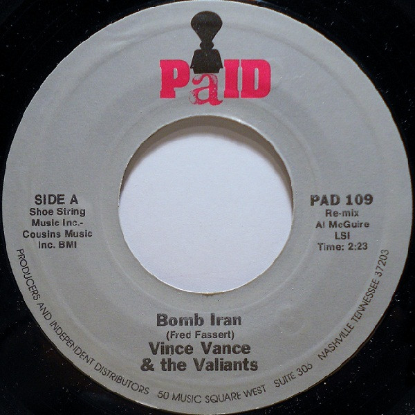

# Bomb Iran

By Vince Vance & The Valiants

## Album Data

[Discogs URL](https://www.discogs.com/release/3408709-Vince-Vance-&-The-Valiants-Bomb-Iran)

- Catalog #: PAD 109
- Label: PaID
- Formats: Vinyl
- Format: 7", Single, Styrene
- Rating: 
- Released: 1980
- Year: 1980
- Release ID: 3408709
- Media condition: Very Good Plus (VG+)
- Sleeve condition: Generic
- Speed: 45 rpm
- Weight: 

## Album Tracks

| **Position** | **Title** | **Duration** |
|--------------|-----------|--------------|
| A | **Bomb Iran** | 2:23 |
| B | **Bye-Bye Baby** | 2:46 |

## See also

- 
