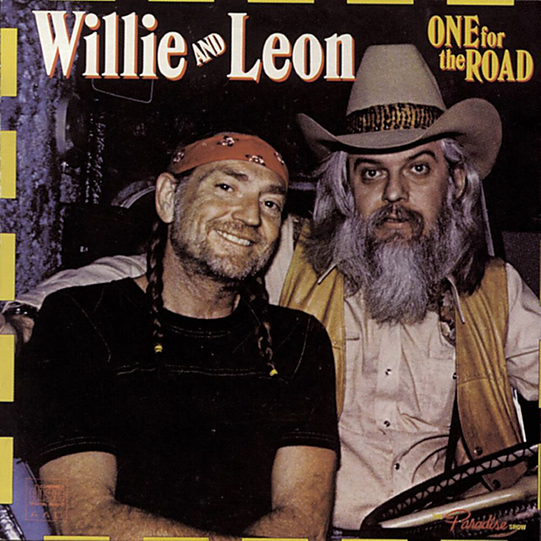

# One For The Road

By Willie Nelson And Leon Russell

## Album Data

[Discogs URL](https://www.discogs.com/release/1712667-Willie-Nelson-And-Leon-Russell-One-For-The-Road)

- Catalog #: KC2 36064, 36064
- Label: Columbia, Columbia
- Format: 2xLP, Album, San
- Rating: 
- Released: 1979
- Release ID: 1712667
- Media condition: Very Good Plus (VG+)
- Sleeve condition: Very Good Plus (VG+)
- Speed: 33 rpm
- Weight: 

## Album Tracks

| **Position** | **Title** | **Duration** |
|--------------|-----------|--------------|
| A1 | **Detour** | 2:24 |
| A2 | **I Saw The Light** | 3:04 |
| A3 | **Heartbreak Hotel** | 3:00 |
| A4 | **Let The Rest Of The World Go By** | 3:46 |
| A5 | **Trouble In Mind** | 2:40 |
| B1 | **Don't Fence Me In** | 2:25 |
| B2 | **The Wild Side Of Life** | 3:21 |
| B3 | **Ridin' Down The Canyon** | 3:20 |
| B4 | **Sioux City Sue** | 3:15 |
| B5 | **You Are My Sunshine** | 2:49 |
| C1 | **Danny Boy** | 3:58 |
| C2 | **Always** | 2:16 |
| C3 | **Summertime** | 2:27 |
| C4 | **Because Of You** | 2:04 |
| C5 | **Am I Blue** | 2:16 |
| D1 | **Tenderly** | 3:58 |
| D2 | **Far Away Places** | 3:08 |
| D3 | **That Lucky Old Sun** | 2:38 |
| D4 | **Stormy Weather** | 2:35 |
| D5 | **One For My Baby And "One More For The Road"** | 2:32 |

## See also

- 
- [Beets: Wasatch Front](../../Beets/Willie_Nelson_And_Leon_Russell/Wasatch_Front.md)
