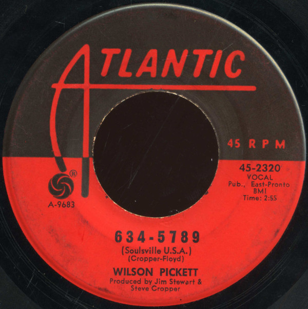

# "634-5789 (Soulsville, U.S.A.)"

By Wilson Pickett

## Album Data

[Discogs URL](https://www.discogs.com/release/6104607-Wilson-Pickett-"634-5789-(Soulsville,-U.S.A.)")

- Catalog #: 45-2320
- Label: Atlantic
- Format: 7", Single
- Rating: 
- Released: 1966
- Release ID: 6104607
- Media condition: Very Good Plus (VG+)
- Sleeve condition: 
- Speed: 45 rpm
- Weight: 

## See also

- [The Best Of Wilson Pickett](The_Best_Of_Wilson_Pickett.md)
