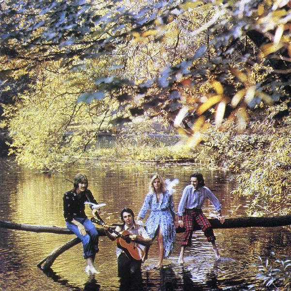

# Wild Life

By Wings

## Album Data

[Discogs URL](https://www.discogs.com/release/7081880-Wings-(2)-Wild-Life)

- Catalog #: SW 3386, SW-3386
- Label: Apple Records, Apple Records
- Format: LP, Album, Los
- Rating: 
- Released: 1971
- Release ID: 7081880
- Media condition: Very Good (VG)
- Sleeve condition: Very Good (VG)
- Speed: 33 rpm
- Weight: 

## Album Tracks

| **Position** | **Title** | **Duration** |
|--------------|-----------|--------------|
| A1 | **Mumbo** | 3:50 |
| A2 | **Bip Bop** | 4:05 |
| A3 | **Love Is Strange** | 4:45 |
| A4 | **Wild Life** | 6:30 |
| B1 | **Some People Never Know** | 6:35 |
| B2 | **I Am Your Singer** | 2:10 |
| B3 | **Untitled** |  |
| B4 | **Tomorrow** | 3:17 |
| B5 | **Dear Friend** | 5:42 |

## Artist Roles

| **Name** | **Role** |
|----------|----------|
| **Denny Seiwell** | Drums |
| **Alan Parsons** | Engineer |
| **Tony Clark** | Engineer |
| **Denny Laine** | Guitar |
| **Lee Hulko** | Lacquer Cut By |
| **Clint Harrigan** | Liner Notes |
| **Lee Hulko** | Mastered By |
| **Paul & Linda McCartney** | Performer |
| **Linda McCartney** | Photography By [Photo, Label A] |
| **Paul McCartney** | Photography By [Photo, Label B] |
| **Barry Lategan** | Photography By [Photo] |
| **Paul & Linda McCartney** | Producer |
| **Carl Dolmetsch** | Recorder [Recorders] |
| **Gordon House (2)** | Typography [Typo] |

## See also

- [Goodnight Tonight](Goodnight_Tonight.md)
- [London Town](London_Town.md)
- [Venus And Mars](Venus_And_Mars.md)
- [Wings Over America](Wings_Over_America.md)
- [Beets: Wild Life](../../Beets/Wings/Wild_Life.md)
- [Roon: Band On The Run](../../Roon/Wings/Band_On_The_Run.md)
- [Roon: Wings At The Speed Of Sound (Archive Collection)](../../Roon/Wings/Wings_At_The_Speed_Of_Sound_Archive_Collection.md)
- [Roon: Wings Over America (Live / Remastered)](../../Roon/Wings/Wings_Over_America_Live_-_Remastered.md)
