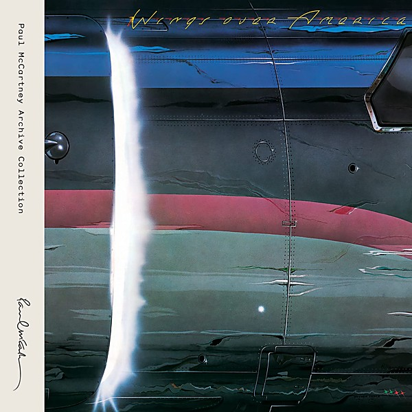

# Wings Over America

By Wings

## Album Data

[Discogs URL](https://www.discogs.com/release/4611368-Wings-(2)-Wings-Over-America)

- Catalog #: HRM-34316-01
- Label: MPL, Hear Music, Concord Music Group
- Format: 3xLP, Album, RE, RM, 180
- Rating: 
- Released: 2013
- Release ID: 4611368
- Media condition: Mint (M)
- Sleeve condition: Mint (M)
- Speed: 33 rpm
- Weight: 180 gram

## Album Tracks

| **Position** | **Title** | **Duration** |
|--------------|-----------|--------------|
| A1 | **Venus And Mars / Rock Show / Jet** |  |
| A2 | **Let Me Roll It** |  |
| A3 | **Spirit Of Ancient Egypt** |  |
| A4 | **Medicine Jar** |  |
| B1 | **Maybe I'm Amazed** |  |
| B2 | **Call Me Back Again** |  |
| B3 | **Lady Madonna** |  |
| B4 | **The Long And Winding Road** |  |
| B5 | **Live And Let Die** |  |
| C1 | **Picasso's Last Words** |  |
| C2 | **Richard Cory** |  |
| C3 | **Bluebird** |  |
| C4 | **I've Just Seen A Face** |  |
| C5 | **Blackbird** |  |
| C6 | **Yesterday** |  |
| D1 | **You Gave Me The Answer** |  |
| D2 | **Magneto And Titanium Man** |  |
| D3 | **Go Now** |  |
| D4 | **My Love** |  |
| D5 | **Listen To What The Man Said** |  |
| E1 | **Let 'Em In** |  |
| E2 | **Time To Hide** |  |
| E3 | **Silly Love Songs** |  |
| E4 | **Beware My Love** |  |
| F1 | **Letting Go** |  |
| F2 | **Band On The Run** |  |
| F3 | **Hi, Hi, Hi** |  |
| F4 | **Soily** |  |

## See also

- [Goodnight Tonight](Goodnight_Tonight.md)
- [London Town](London_Town.md)
- [Venus And Mars](Venus_And_Mars.md)
- [Wild Life](Wild_Life.md)
- [Beets: Wild Life](../../Beets/Wings/Wild_Life.md)
- [Roon: Band On The Run](../../Roon/Wings/Band_On_The_Run.md)
- [Roon: Wings At The Speed Of Sound (Archive Collection)](../../Roon/Wings/Wings_At_The_Speed_Of_Sound_Archive_Collection.md)
- [Roon: Wings Over America (Live / Remastered)](../../Roon/Wings/Wings_Over_America_Live_-_Remastered.md)
