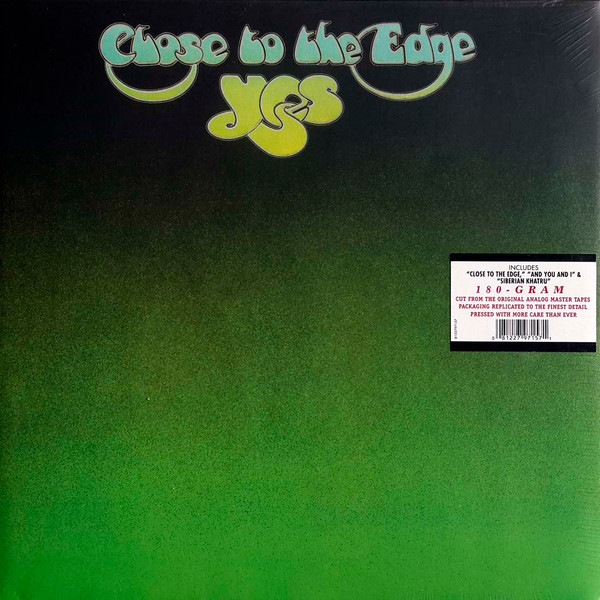

# Close To The Edge

By Yes

## Album Data

[Discogs URL](https://www.discogs.com/release/4070858-Yes-Close-To-The-Edge)

- Catalog #: 8122797157
- Label: Atlantic
- Format: LP, Album, Ltd, RE, Gat
- Rating: 
- Released: 2012
- Release ID: 4070858
- Media condition: Mint (M)
- Sleeve condition: Mint (M)
- Speed: 33 rpm
- Weight: 180 gram

## Album Tracks

| **Position** | **Title** | **Duration** |
|--------------|-----------|--------------|
|  | **Close To The Edge** | 18:50 |
|  | **And You And I** | 10:09 |
| B2 | **Siberian Khatru** | 8:57 |

## See also

- [Fragile](Fragile.md)
- [Progeny](Progeny-_Highlights_From_Seventy-Two.md)
- [The Yes Album](The_Yes_Album.md)
- [Yessongs](Yessongs.md)
- [Beets: Close to the Edge (2013 Stereo Mixes)](../../Beets/Yes/Close_to_the_Edge_2013_Stereo_Mixes.md)
- [Beets: Close To The Edge](../../Beets/Yes/Close_To_The_Edge.md)
- [Beets: Fragile (Deluxe Version)](../../Beets/Yes/Fragile_Deluxe_Version.md)
- [Beets: Fragile](../../Beets/Yes/Fragile.md)
- [Beets: The Yes Album [Expanded & Remastered] (US Release)](../../Beets/Yes/The_Yes_Album_[Expanded_and_Remastered]_US_Release.md)
- [Beets: The Yes Album](../../Beets/Yes/The_Yes_Album.md)
- [CD: Close To The Edge (Definitive Edition)](../../CD/Yes/Close_To_The_Edge_Definitive_Edition.md)
- [CD: Fragile](../../CD/Yes/Fragile.md)
- [CD: ](../../CD/Yes/Yes.md)
- [Roon: Close to the Edge](../../Roon/Yes/Close_to_the_Edge.md)
- [Roon: Fragile](../../Roon/Yes/Fragile.md)
- [Roon: The Steven Wilson Remixes](../../Roon/Yes/The_Steven_Wilson_Remixes.md)
- [Roon: The Yes Album](../../Roon/Yes/The_Yes_Album.md)
- [Roon: Yes](../../Roon/Yes/Yes.md)
