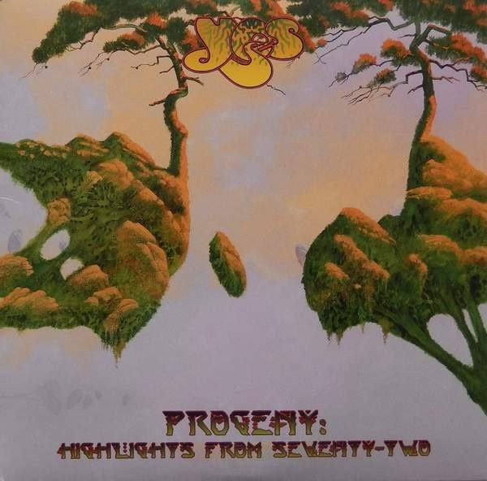

# Progeny: Highlights From Seventy-Two

By Yes

## Album Data

[Discogs URL](https://www.discogs.com/release/7116500-Yes-Progeny:-Highlights-From-Seventy-Two)

- Catalog #: R1 545488
- Label: Rhino Records (2), Atlantic
- Format: 3xLP, Album
- Rating: 
- Released: 2015
- Release ID: 7116500
- Media condition: Mint (M)
- Sleeve condition: Mint (M)
- Speed: 33 rpm
- Weight: 180 gram

## See also

- [Close To The Edge](Close_To_The_Edge.md)
- [Fragile](Fragile.md)
- [The Yes Album](The_Yes_Album.md)
- [Yessongs](Yessongs.md)
