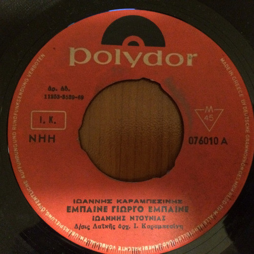

# Έμπαινε Γιώργο Έμπαινε / Στης Πλάκας Της Ανηφοριές

By "Γιάννης Ντουνιάς, Γιάννης Καραμπεσίνης"

## Album Data

[Discogs URL](https://www.discogs.com/release/5284114-"Γιάννης-Ντουνιάς,-Γιάννης-Καραμπεσίνης"-Έμπαινε-Γιώργο-Έμπαινε-/-Στης-Πλάκας-Της-Ανηφοριές)

- Catalog #: 076010
- Label: Polydor
- Formats: Vinyl
- Format: 7", Single, 45 RPM
- Rating: 
- Released: 1969
- Year: 1969
- Release ID: 5284114
- Media condition: Very Good Plus (VG+)
- Sleeve condition: 
- Speed: 45 rpm
- Weight: 

## Album Tracks

| **Position** | **Title** | **Duration** |
|--------------|-----------|--------------|
| A | **Έμπαινε Γιώργο Έμπαινε** |  |
| B | **Στης Πλάκας Της Ανηφοριές** |  |

## Artist Roles

| **Name** | **Role** |
|----------|----------|
| **Γιάννης Καραμπεσίνης** | Directed By [Λαϊκής όρχ.] |
| **Γιάννης Καραμπεσίνης** | Songwriter |

## See also

- 
